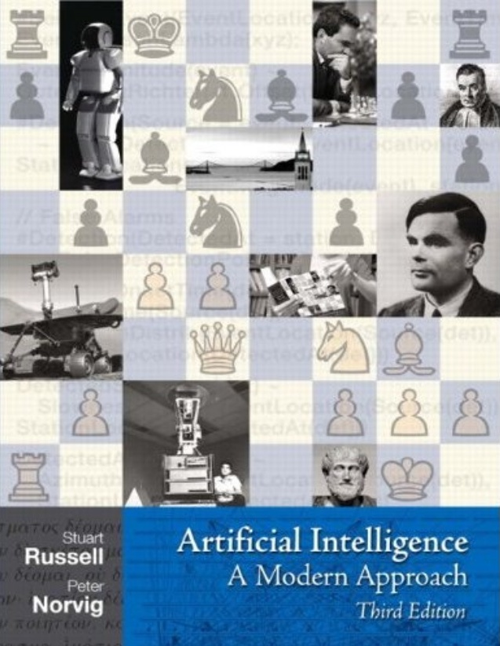

## Artificial Intelligence - CMP SCI 4300/5300
## Syllabus - 2019 Fall

[Academic Calendar](https://www.umsl.edu/services/fa/telephone-directory/academic_calendar.pdf) | [Resources & Support](https://umsl.instructure.com/courses/44471/pages/student-resources-and-supports?module_item_id=454221) |  [Technology Assistance](https://umsl.instructure.com/courses/44471/pages/technology-assistance?module_item_id=454223) | [Final Exam Schedule](https://www.umsl.edu/~registration/final-exams.html)

## About the Instructor
* Name: Badri Adhikari
* Email: adhikarib@umsl.edu (Please use your university email account to send me emails)
* Office Hours: Mondays from 12:30 PM to 2 PM & Wednesdays from 12:30 PM to 2 PM
* Office Location: 312 ESH
* Homepage: [https://badriadhikari.github.io](https://badriadhikari.github.io)

## About the Course
* This course provides an introduction to artificial intelligence (AI). The list of topics may include artificial neural networks, search, planning, knowledge-based reasoning, probabilistic inference, machine learning, natural language processing, and practical applications. \[3 credit units\].

**Prerequisites**  
* CMP SCI 3130 (Design and Analysis of Algorithms) or Graduate Standing in CS

**Upon completing the course students will be able to (Learning Outcomes):** 
* Use Python, Numpy and Keras to design, train, and evaluate basic feed-forward neural networks
* Learn an overview of artificial intelligence principles and approaches
* Learn a basic understanding of the building blocks of AI as presented in terms of intelligent agents
* Select and evaluate various searching algorithms
* Understand some of the problems and ideas in the field of natural language processing, perception, and robotics
* Learn the philosophical foundations of AI and the future of AI
* Implement various AI algorithms

**Class meets**
* MW 11:00 AM - 12:15 PM at SSB 218
* Lectures will also be delivered "live" accessible via Zoom (see Canvas page for the link)

**Course Materials**
* Slides, Homeworks, Project, Tests, and Test Samples are inside the relevant folders at the Github location - https://github.com/badriadhikari/2019-Fall-AI/

**Textbooks**
* Artificial Intelligence: A Modern Approach (3rd Edition)     

## Course Topics
**Introduction to Python, Numpy, and Google Colab**
**Chapter 18 - Learning From Examples** 
**Designing and Implementing Feed-forward Neural Networks**
**Chapter 1 - Introduction**  
**Chapter 2 - Intelligent Agents**  
**Chapter 3 - Solving Problems by Searching**  
**Chapter 5 - Adversarial Search**  
**Chapter 6 - Constraint Satisfaction Problems**  
**Chapter 7 - Logical Agents**  
**Chapter 22 - Natural Language Processing**  
**Chapter 24 - Perception**  
**Chapter 25 - Robotics**  
**Chapter 26 - Philosophical Foundations**  

## Course Schedule
This schedule will be updated as the class progresses.  

| `Week` | `Day` | `Date` | `Topic` | 
| --- | --- | --- | --- | 
| 01 | 01 | Jan 22, Tue | Syllabus; Chapter 1 - Slide 1 to 28 |
| 01 | 02 | Jan 24, Thu | Chapter 1 - Slide 29 to END; Chapter 2 - Slide 1 to 10 |
| 02 | 03 | Jan 29, Tue | Chapter 2 - Slide 11 to END; Chapter 18 - Slide 1 to 24 |
| 02 | 04 | Jan 31, Thu | Chapter 18 - Slide 25 to 34 |
| 03 | 05 | Feb 05, Tue | Syllabus; Chapter 18 - Slide 24 (activity); Chapter 18 - Slide 35 to 47 |
| 03 | 06 | Feb 07, Thu | Chapter 18 - Slide 48 to END; Chapter 3 - Slide 1 to 12 |
| 04 | 07 | Feb 12, Tue | Chapter 3 - Slide 13 to 48 |
| 04 | 08 | Feb 14, Thu | Chapter 3 - Slide 49 to 72 |
| 05 | 09 | Feb 19, Tue | Review Questions for TEST 1 |
| 05 | 10 | Feb 21, Thu | TEST 1 [Covering Chapter 1, 2, 18 & 3 (upto BFS)]|
| 06 | 11 | Feb 26, Tue | Chapter 3 - Slide 73 to 79 |
| 06 | 12 | Feb 28, Thu | Outline of Project Requirements; Chapter 3 - Slide 80 to END |
| 07 | 13 | Mar 05, Tue | Chapter 5 - Slide 1 to 17 |
| 07 | 14 | Mar 07, Thu | Discussion of Project Ideas |
| 08 | 15 | Mar 12, Tue | Chapter 5 - Slide 18 to END (Alhpa-beta pruning) |
| 08 | 16 | Mar 14, Thu | Project Lab at "Clark Hall - 00400" |
| 09 | 17 | Mar 19, Tue | Chapter 6 - Slide 1 to 26 |
| 09 | 18 | Mar 21, Thu | Project Lab |
| - | - | - | Spring Recess |
| 10 | 19 | Apr 02, Tue | Review Questions for TEST 2 |
| 10 | 20 | Apr 04, Thu | Test 2 [Covering Ch3 (slide 73 onwards), Ch5, and Ch6 (upto slide 26)] |
| 11 | 21 | Apr 09, Tue | No Class |
| 11 | 22 | Apr 11, Thu | Chapter 6 - Slide 27 to END; Chapter 7 - Slide 1 to 10 |
| 12 | 23 | Apr 16, Tue | Chapter 7 - Slide 11 to 21 |
| 12 | 24 | Apr 18, Thu | Chapter 7 - Slide 22 to END; Chapter 22 - Slide 1 to 5 |
| 13 | 25 | Apr 23, Tue | Chapter 22 - Slide 6 to 19 |
| 13 | 26 | Apr 25, Thu | Chapter 22 - Slide 20 to END; Chapter 26 - Slide 1 to 10 |
| 14 | 27 | Apr 30, Tue | Chapter 26 - Slide 11 to END; Chapter 25 - Slide 1 to 16 |
| 14 | 28 | May 02, Thu | Review for Test 3; Project Code and Report Due |
| 15 | 29 | May 07, Tue | Chapter 24 (Perception) - Guest Lecture by Sri Harsha Akurathi |
| 15 | 30 | May 09, Thu | Test 3 + Remind about (a) Programming Competition, and (b) Course Evaluation |
| - | - | - | (Final Exam) - Poster Presentations on Monday, 9th December, 10 AM to Noon |  

## Course Policies

**Late Homework/Project Submission** 
* You have a total of 5 late days
* Once you use your late days, late submissions will get no points

**General**
* Keep yourself out of plagarism - Read [UMSL's Policy](https://www.umsl.edu/services/academic/policy/academic-dishonesty.html)
* Lecture recordings, audio or video, are not permitted
* You are welcome to bring your laptop in class

**Projects**
* Please see the 'project' folder.

**Homeworks**
* Please see the 'homeworks' folder.

**Tests** 
* There will be three tests including one final (see the schedule for dates)
* Test will be CLOSED book, CLOSED notes, and CLOSED electronics
* Use of any type of electronics is strictly forbidden during tests

**Attendance**  
* Attendance will be recorded in every class for the first five weeks
* More than two uninformed absenses in the first five weeks will automatically lead to failing the course

## Assessment/Grading
**Grade Composition**
* 10 points = Homeworks
* 30 points = Tests
* 20 points = Project Proposal and Initial Report
* 20 points = Peer-review of proposals and reports
* 20 points = Project Poster Presentation & Final Report  
* 1 bonus point to everyone in the class if 80%+ complete the course evaluation survey

**Grading Scheme**  

| `Grade` | `Points` | 
| --- | --- | 
| A | 100% to 94% | 
| A- | <94% to 90% | 
| B+ | <90% to 87% | 
| B | <87% to 84% | 
| B- | <84% to 80% |
| C+ | <80% to 77% |
| C | <77% to 74% |
| C- | <74% to 70% |
| D+ | <70% to 67% |
| D | <67% to 64% |
| D- | <64% to 61% |
| F | <61% to 0% |

---------------
## Students' Projects
Will be updated towards the end!
