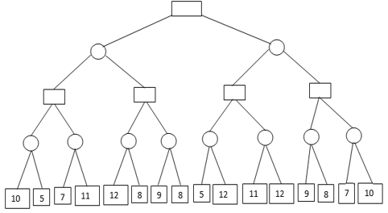

# Homework Expectations  
* Homeworks need to be submitted through Canvas
* All programming homeworks must be completed in Python programming language
* You are strongly encouraged to use online compilers such as Google Colab (Jupyter Notebooks) or https://repl.it/
* You are responsible for submitting a program that "RUNS"; You will automatically receive a 0 or very low points for a submission that does not run
* All programming homework submissions must include a screenshot of the output; submissions without screenshot may receive a 0

# Homeworks  
## Programming Homework 1 (Chapter 3)  
With your choice of programming language, implement the Breadth First Search algorithm, to find solution for the Romania route finding problem, i.e. find the shortest path to reach Bucharest from Arad.  
 

## Homework 2 (Chapter 4)
For the following game tree, show which nodes/sub-tree will be pruned by the Alpha-Beta pruning algorithm. Assume that the nodes are processed from left to right. Note that this is not a programming homework. You can solve it in paper, take a picture, and submit it at Canvas.

## Programming Homework 3 (Chapter 22) 
WAP to calculate the BM25 score!

## Programming Homework 4 (Chapter 22) 
Calculate the PageRanks!

## Programming Homework 5 (Chapter 24)  
Implement convolution function!

